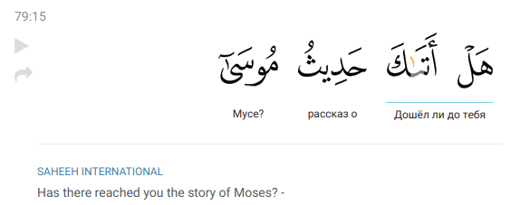
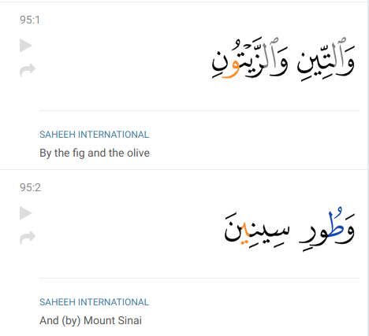
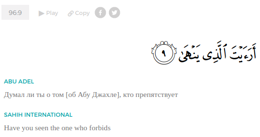
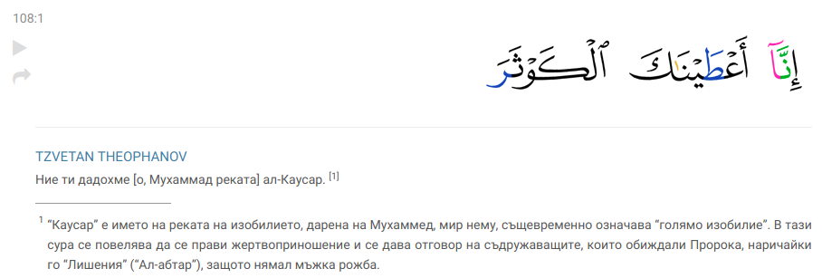

# Translation texts

Texts of translations are formatted in special standardized way which is described on this page.


There are some differences in formatting for JSON and XML. Although they are minor, it is important to know about them. See [Translation texts](translation-texts.md#translation-comments-and-footnotes) section below for details.


## Symbols style guide

**ENCODING**. All translations texts are UTF-8 encoded.

**QUOTATION MARKS \(**«»**\)** should be conventional for the language — not straight quotes. Conventional quotation marks for each language are available [here](https://en.wikipedia.org/wiki/Quotation_mark).

**HYPHENS.** Double\(`--`\) or triple hyphens \(`---`\) are replaced with a single em dash \(`—`\) with a white space before and after it. Single hyphen is used only for word connection, like in "follow-up" word. In such case hyphen has no white space before or after.

**PUNCTUATION**. The language's punctuation is used. For example, Farsi translation has Farsi comma, not Latin \(ASCII\).

## Merged translations

Some by-ayah translations and most of word-by-word translations have merged translations: cases when multiple consecutive words \(or ayah for by-ayah translations\) share one translation. For example, the first two words in the following picture have a merged word-by-word translation.



In such cases, translation text is put in only in the first \(word or ayah\) in the sequence. As for the following, their translation text is a one symbol -- `*`. I.e. for the provided example above translation looks like so:



```javascript
"words": [
    {
        "number": 1,
        "text": "Дошёл ли до тебя"
    },
    {
        "number": 2,
        "text": "*"
    },
    {
        "number": 3,
        "text": "рассказ о"
    },
    {
        "number": 3,
        "text": "Мусе?"
    }
]
```



```markup
<words>
    <word number="1">Дошёл ли до тебя</word>
    <word number="2">*</word>
    <word number="3">рассказ о</word>
    <word number="4">Мусе?</word>
</words>
```



## **Translation comments & footnotes \(`(`, `[`, `[[`, ...\)**


We try our best to stick with this convention of separation between `(`, `[`, and footnotes. But in some cases, it is difficult to distinguish between them. Besides, authors may have different opinions. So, from our side, we ask authors to follow these rules but we leave the decision for them. Keep this in mind when use translations.


Translation comments are of two types

**1. Short inline comments.** These comments are short specifying comments which must be placed inline with the translation. Both single parenthesis and single brackets are allowed for them. 

The convention is to use single parenthesis \(`(...)`\) for words which are implicitly implied in the original Arabic text. Like in the following example below:



And single brackets \(`[...]`\) for words which are added by the author for a specification but presented neither explicitly nor implicitly in the original Arabic text. For example, in the picture below, the author specifies that "the one who forbids" is Abu Jahl. In English, it would look like "Have you seen \[Abu Jahl\] the one who forbids". "Abu Jahl" is not presented in the original Arabic text, it is a specification of the translator according to tafseers and opinions of scholars, so it is put in single brackets.



**2. A detailed explanatory comment.** A detailed comment is something we see as a footnote in a book. It is a broad explanation which is usually quite a long text. Some Quran translations use `[[` for them, some use footnotes. The standard of this project is to use footnotes like so:



**Such translations has different format in JSON and XML.**



```javascript
"ayahs": [
    {
        "number": 1,
        "text": "Ние ти дадохме [о, Мухаммад реката] ал-Каусар.[^1]\n\n[^1]: “Каусар” е името на реката на изобилието, дарена на Мухаммед, мир нему, същевременно означава “голямо изобилие”. В тази сура се повелява да се прави жертвоприношение и се дава отговор на съдружаващите, които обиждали Пророка, наричайки го “Лишения” (“Ал-абтар”), защото нямал мъжка рожба."
    },
    ...
]
```



```markup
<ayahs>
    <ayah number="1">
        Ние ти дадохме [о, Мухаммад реката] ал-Каусар.<footnote id="1"/>
        <footnotes>
            <footnote-content id="1">
                “Каусар” е името на реката на изобилието, дарена на Мухаммед, мир нему, същевременно означава “голямо изобилие”. В тази сура се повелява да се прави жертвоприношение и се дава отговор на съдружаващите, които обиждали Пророка, наричайки го “Лишения” (“Ал-абтар”), защото нямал мъжка рожба.
            </footnote-content>
        </footnotes>
    </ayah>
    ...
```



JSON format is simply a markdown-formatted footnote:

```text
Ние ти дадохме [о, Мухаммад реката] ал-Каусар.[^1]

[^1]: “Каусар” е името на реката на изобилието, дарена на Мухаммед, мир нему, същевременно означава “голямо изобилие”. В тази сура се повелява да се прави жертвоприношение и се дава отговор на съдружаващите, които обиждали Пророка, наричайки го “Лишения” (“Ал-абтар”), защото нямал мъжка рожба.
```

where `\n` is used for a line-break.


